#  Vision Artificielle - Traitement d'Images

**Démonstration complète des algorithmes de traitement d'images appliqués sur 3 images spécifiques**

[](https://www.python.org/)
[](https://opencv.org/)
[](https://numpy.org/)
[](LICENSE)

##  À propos du projet

Ce projet implémente **manuellement** les algorithmes fondamentaux du traitement d'images étudiés dans le module de Vision Artificielle, sans utiliser les fonctions prêtes d'OpenCV (sauf pour le chargement/affichage). L'objectif est pédagogique : comprendre le fonctionnement interne des algorithmes tout en produisant des visualisations professionnelles.

###  Objectifs pédagogiques
- Implémenter manuellement les algorithmes clés du traitement d'images
- Comparer les différentes techniques sur des cas concrets
- Analyser statistiquement les résultats
- Produire des visualisations claires et professionnelles

##  Images utilisées

Le projet utilise 3 images spécifiques pour démontrer les algorithmes :

| Image | Description | Usage démonstratif |
|-------|-------------|-------------------|
| **cr7-messi.jpg** | Cristiano Ronaldo et Lionel Messi | Détection de visages, conversion couleur |
| **cr7-messi2.jpg** | Deuxième photo des deux joueurs | Comparaison d'images similaires |
| **opencv_logo.webp** | Logo officiel d'OpenCV | Détection de formes géométriques |

##  Démarrage rapide

### Prérequis
- Python 3.8 ou supérieur
- pip (gestionnaire de packages Python)

### Installation

```bash
# 1. Clonez le dépôt
git clone https://github.com/YehiaElkh/vision-artificielle-traitement-images.git
cd vision-artificielle-traitement-images

# 2. Installez les dépendances
pip install -r requirements.txt

# 3. Placez vos images dans le dossier images/
# (Les images doivent s'appeler exactement)

```

### Structure attendue des images
    
        images/
        ├── cr7-messi.jpg
        ├── cr7-messi2.jpg
        └── opencv_logo.webp

### Utilisation

    Mode principal:                       python3 main.py
    Mode interactif (Jupyter Notebook):   jupyter notebook notebooks/demo.ipynb
    Arguments de ligne de commande: 
                                          # Traiter une image spécifique
                                          python main.py --image images/cr7-messi.jpg
                                          # Générer seulement certaines visualisations
                                          python main.py --plots basic,histogram
                                          
## Fonctionnalités implémentées

 1. Conversions d'espaces de couleur
    BGR → Niveaux de gris : Formule pondérée ITU-R BT.601
    RGB → YUV : Séparation luminance/chrominance
    RGB → HSV : Espace intuitif (Teinte, Saturation, Valeur)
    
 2. Seuillage (Thresholding)
    Seuillage fixe global : T constant pour toute l'image
    Seuillage adaptatif : T calculé localement
    Seuillage d'Otsu : Méthode automatique optimale
    
 3. Filtrage spatial
    Filtre gaussien : Lissage pondéré (réduction bruit)
    Filtre médian : Non-linéaire (bruit sel et poivre)
    Filtre de Sobel : Détection de contours
    Convolution 2D : Implémentation manuelle complète
    
 4. Morphologie mathématique
    Érosion : Réduction des objets blancs
    Dilatation : Agrandissement des objets blancs
    Ouverture : Érosion suivie de dilatation
    Fermeture : Dilatation suivie d'érosion
    
 5. Analyses et statistiques
    Calcul d'histogramme : Distribution des intensités
    Statistiques descriptives : Moyenne, écart-type, min/max
    Comparaison automatique : Tableaux et graphiques comparatifs

### Sorties générées

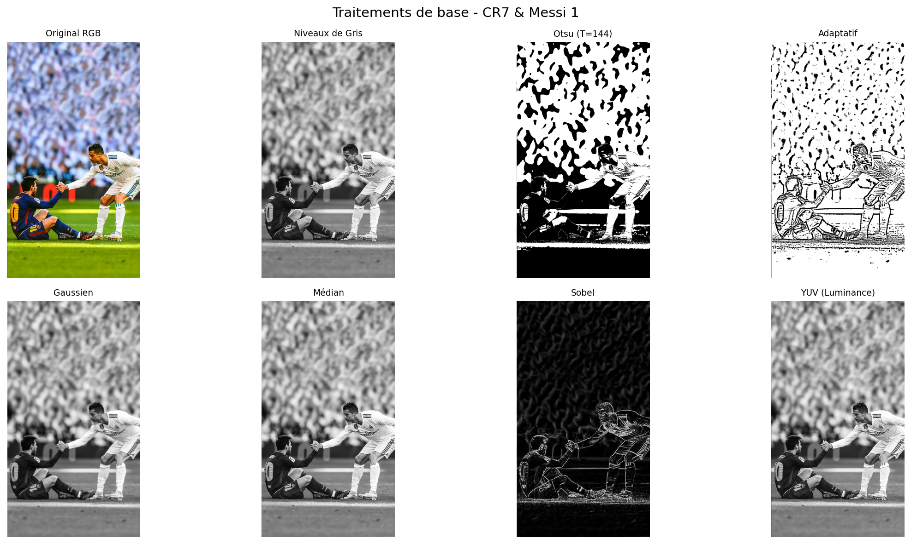
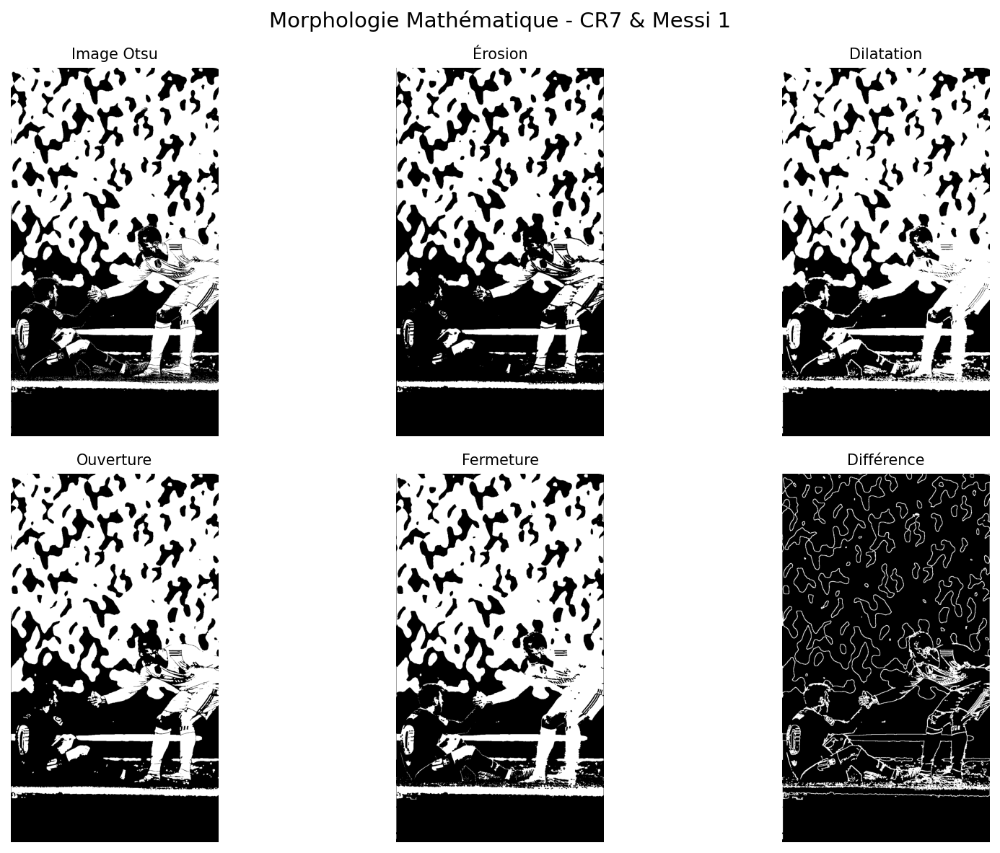
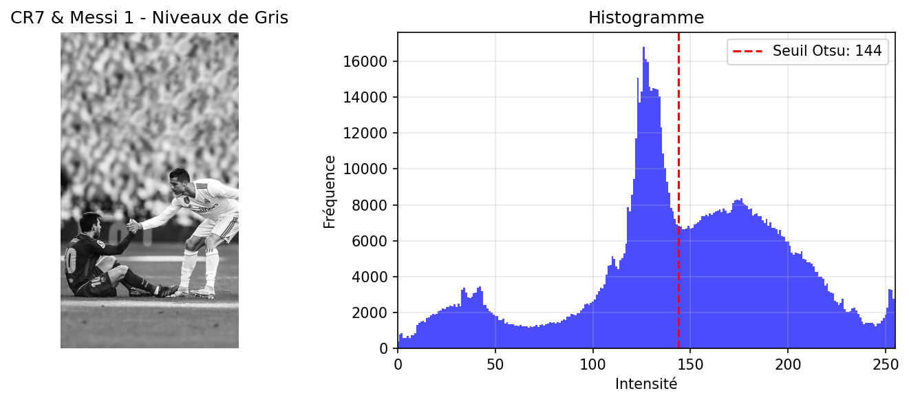

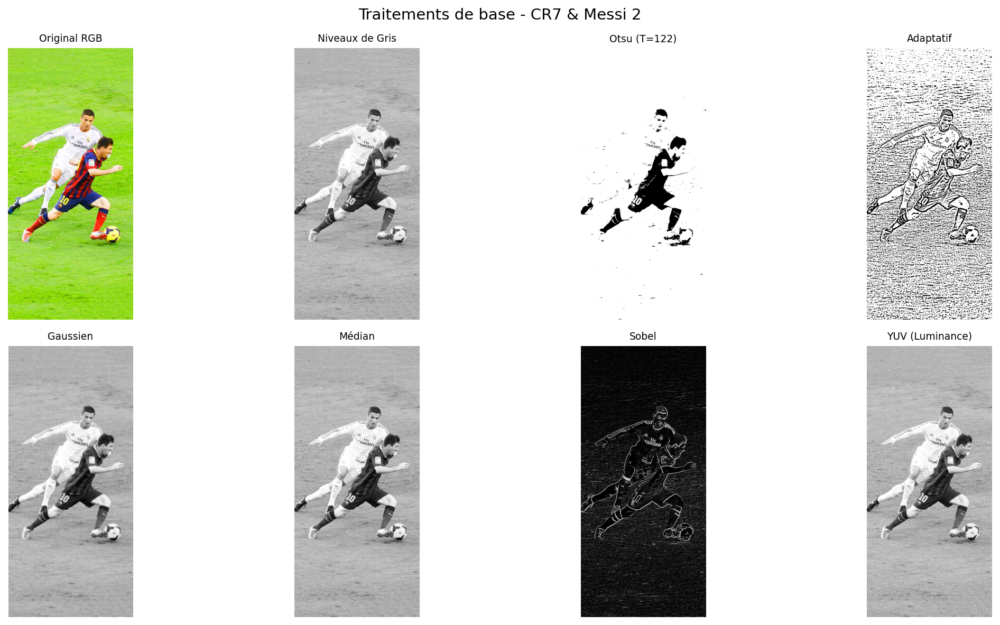
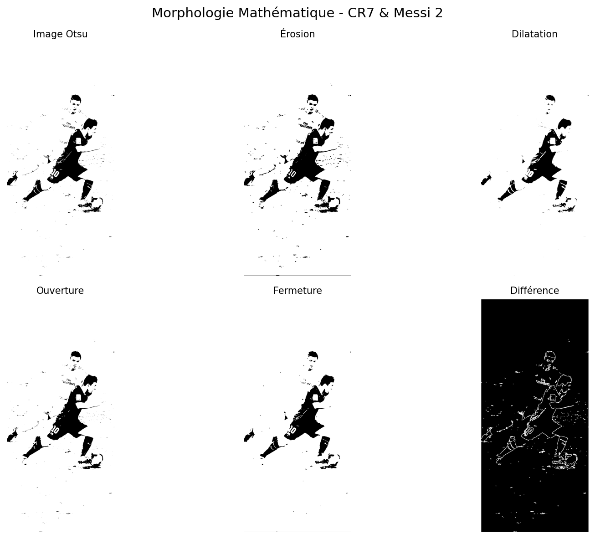
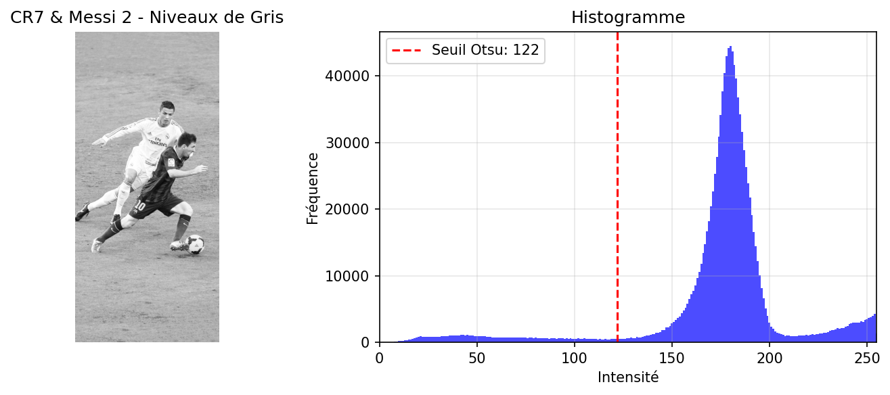

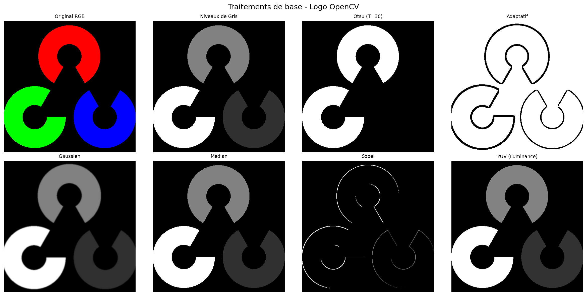
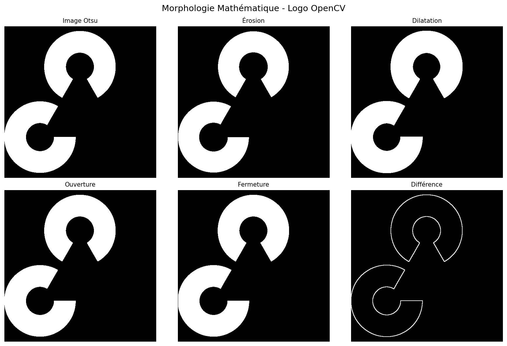
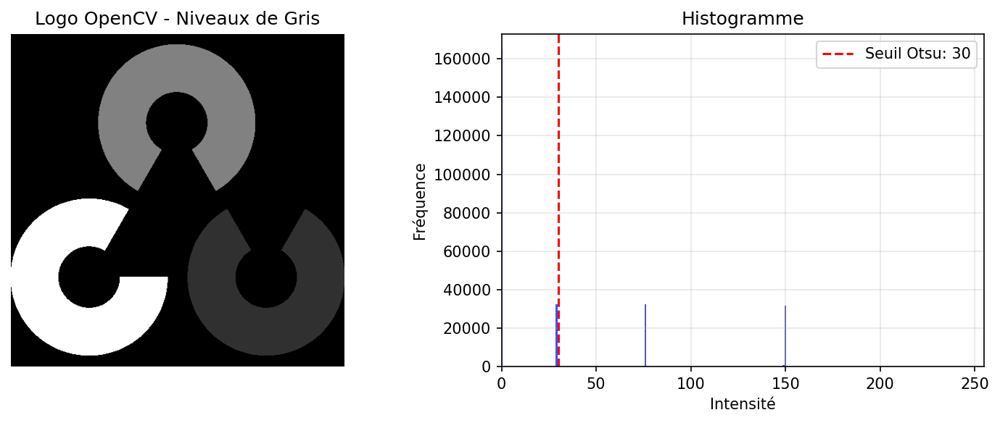

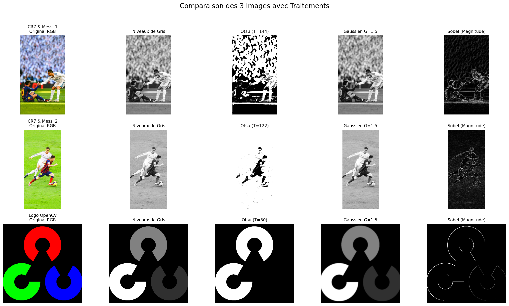
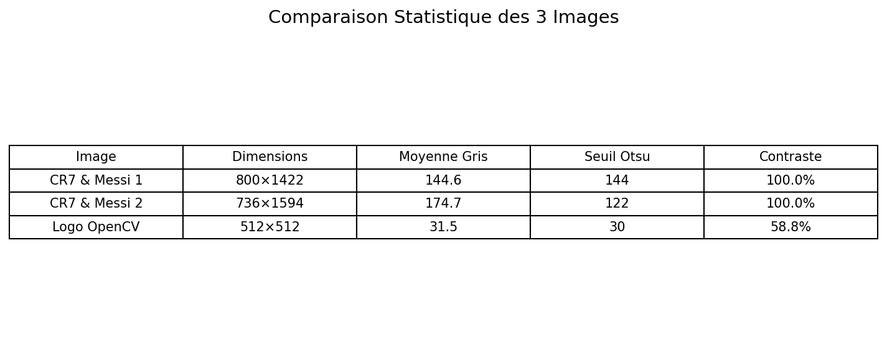
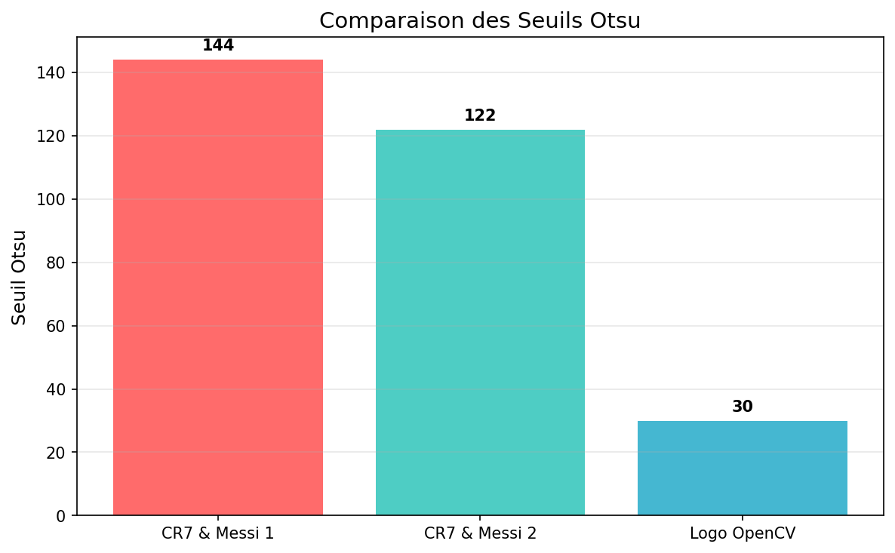

### Structure du code

        vision-artificielle-traitement-images/
        ├── images/                          # Dossier des images
        │   ├── cr7-messi.jpg               # Image 1 : CR7 & Messi
        │   ├── cr7-messi2.jpg              # Image 2 : CR7 & Messi (2)
        │   └── opencv_logo.webp            # Image 3 : Logo OpenCV
        │
        ├── src/                            # Code source
        │   ├── __init__.py
        │   └── traitement_images.py        # Tous les algorithmes
        │
        ├── notebooks/                       # Notebooks Jupyter
        │   └── demo.ipynb                  # Démo interactive
        │
        ├── main.py                         # Script principal
        ├── requirements.txt                # Dépendances Python
        ├── README.md                       # Documentation
        └── .gitignore                      


### Références et ressources

- Documentation officielle
    OpenCV Documentation
    NumPy Documentation
    Matplotlib Documentation

- Articles académiques
    Otsu, N. (1979). "A Threshold Selection Method from Gray-Level Histograms"
    ITU-R Recommendation BT.601 "Studio encoding parameters of digital television"

**Lien vers le Dépôt GitHub :** [https://github.com/ElkhoulatiYahya/vision-artificielle-traitement-images]
